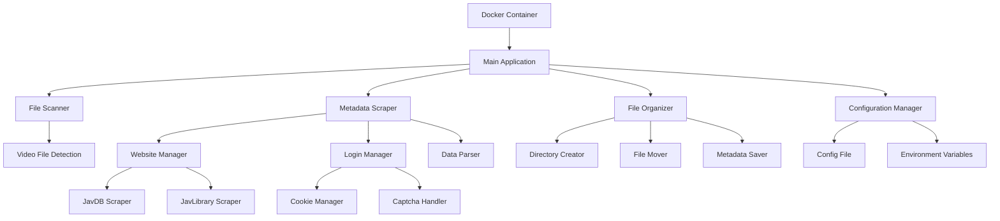

# Design Document

## Overview

AV Metadata Scraper是一个基于Python的自动化影片元数据刮削和整理系统，采用Docker容器化部署。系统使用Selenium WebDriver进行网站自动化操作，结合BeautifulSoup进行HTML解析，实现从多个数据源获取影片元数据并自动整理本地视频文件。

## Architecture

### 系统架构图



### 技术栈

- **Python 3.9+**: 主要开发语言
- **Selenium WebDriver**: 浏览器自动化和JavaScript渲染
- **BeautifulSoup4**: HTML解析
- **Requests**: HTTP请求处理
- **Pillow**: 图像处理
- **Docker**: 容器化部署
- **Chrome/Chromium**: 无头浏览器
- **SQLite**: 本地数据存储（可选）

## Components and Interfaces

### 1. File Scanner Component

**职责**: 扫描指定目录下的视频文件

```python
class FileScanner:
    def __init__(self, source_directory: str, supported_formats: List[str])
    def scan_directory(self) -> List[VideoFile]
    def extract_code_from_filename(self, filename: str) -> Optional[str]
    def is_video_file(self, file_path: str) -> bool
```

**接口**:
- 输入: 源目录路径、支持的视频格式列表
- 输出: VideoFile对象列表

### 2. Metadata Scraper Component

**职责**: 从各个网站刮削影片元数据

```python
class MetadataScraper:
    def __init__(self, scrapers: List[BaseScraper])
    def scrape_metadata(self, video_code: str) -> Optional[MovieMetadata]
    def get_available_scrapers(self) -> List[str]

class BaseScraper(ABC):
    @abstractmethod
    def search_movie(self, code: str) -> Optional[MovieMetadata]
    @abstractmethod
    def is_available(self) -> bool

class JavDBScraper(BaseScraper):
    def __init__(self, login_manager: LoginManager)
    def search_movie(self, code: str) -> Optional[MovieMetadata]
    def login_if_needed(self) -> bool

class JavLibraryScraper(BaseScraper):
    def search_movie(self, code: str) -> Optional[MovieMetadata]
```

### 3. Login Manager Component

**职责**: 处理网站登录和会话管理

```python
class LoginManager:
    def __init__(self, username: str, password: str, driver: WebDriver)
    def login(self) -> bool
    def is_logged_in(self) -> bool
    def refresh_session(self) -> bool
    def handle_captcha(self) -> bool
    def save_cookies(self) -> None
    def load_cookies(self) -> None
```

### 4. File Organizer Component

**职责**: 根据元数据整理视频文件

```python
class FileOrganizer:
    def __init__(self, target_directory: str, naming_pattern: str)
    def organize_file(self, video_file: VideoFile, metadata: MovieMetadata) -> bool
    def create_directory_structure(self, path: str) -> None
    def move_file(self, source: str, target: str) -> bool
    def save_metadata(self, metadata: MovieMetadata, target_dir: str) -> None
    def download_images(self, metadata: MovieMetadata, target_dir: str) -> None
```

### 5. Configuration Manager Component

**职责**: 管理系统配置

```python
class ConfigManager:
    def __init__(self, config_file: str = None)
    def load_config(self) -> Dict
    def get(self, key: str, default=None) -> Any
    def validate_config(self) -> bool
```

## Data Models

### VideoFile Model

```python
@dataclass
class VideoFile:
    file_path: str
    filename: str
    file_size: int
    extension: str
    detected_code: Optional[str] = None
    created_time: datetime = None
    modified_time: datetime = None
```

### MovieMetadata Model

```python
@dataclass
class MovieMetadata:
    code: str
    title: str
    title_en: Optional[str] = None
    actresses: List[str] = field(default_factory=list)
    release_date: Optional[date] = None
    duration: Optional[int] = None
    studio: Optional[str] = None
    series: Optional[str] = None
    genres: List[str] = field(default_factory=list)
    cover_url: Optional[str] = None
    poster_url: Optional[str] = None
    screenshots: List[str] = field(default_factory=list)
    description: Optional[str] = None
    rating: Optional[float] = None
    source_url: str = None
    scraped_at: datetime = field(default_factory=datetime.now)
```

### Configuration Model

```python
@dataclass
class Config:
    # 目录配置
    source_directory: str
    target_directory: str
    
    # 登录配置
    javdb_username: Optional[str] = None
    javdb_password: Optional[str] = None
    
    # 刮削配置
    scraper_priority: List[str] = field(default_factory=lambda: ['javdb', 'javlibrary'])
    max_concurrent_files: int = 3
    retry_attempts: int = 3
    
    # 文件命名配置
    naming_pattern: str = "{actress}/{code}/{code}.{ext}"
    
    # 浏览器配置
    headless_browser: bool = True
    browser_timeout: int = 30
    
    # 代理配置
    proxy_url: Optional[str] = None
    
    # 其他配置
    download_images: bool = True
    save_metadata: bool = True
    log_level: str = "INFO"
```

## Error Handling

### 错误分类和处理策略

1. **网络错误**
   - 连接超时: 重试机制，最多3次
   - HTTP错误: 记录错误码，尝试其他数据源
   - 代理错误: 切换到直连或其他代理

2. **登录错误**
   - 验证码识别失败: 记录日志，跳过当前文件
   - 账号被封: 停止使用该数据源
   - Cookie过期: 自动重新登录

3. **文件操作错误**
   - 权限不足: 记录错误，跳过文件
   - 磁盘空间不足: 停止处理，发出警告
   - 文件已存在: 根据配置决定覆盖或跳过

4. **数据解析错误**
   - HTML结构变化: 记录错误，尝试其他解析策略
   - 编码问题: 尝试多种编码方式
   - 数据不完整: 使用部分数据或标记为失败

### 错误恢复机制

```python
class ErrorHandler:
    def __init__(self, max_retries: int = 3)
    def handle_network_error(self, error: Exception, context: Dict) -> bool
    def handle_login_error(self, error: Exception) -> bool
    def handle_file_error(self, error: Exception, file_path: str) -> bool
    def should_retry(self, error_type: str, attempt: int) -> bool
```

## Testing Strategy

### 单元测试

1. **File Scanner Tests**
   - 测试不同格式的视频文件识别
   - 测试番号提取算法
   - 测试目录递归扫描

2. **Scraper Tests**
   - 模拟网站响应测试数据解析
   - 测试登录流程（使用测试账号）
   - 测试错误处理和重试机制

3. **File Organizer Tests**
   - 测试文件移动和重命名
   - 测试目录结构创建
   - 测试元数据保存

### 集成测试

1. **端到端测试**
   - 使用测试视频文件进行完整流程测试
   - 验证最终的文件组织结果
   - 测试Docker容器部署

2. **网站兼容性测试**
   - 定期测试各个数据源网站的可用性
   - 验证HTML解析的准确性
   - 测试反爬虫机制的应对

### 性能测试

1. **并发处理测试**
   - 测试多文件同时处理的性能
   - 验证内存使用情况
   - 测试网络请求的并发限制

2. **大文件处理测试**
   - 测试大型视频文件的移动性能
   - 验证长时间运行的稳定性

## Docker Configuration

### Dockerfile设计

```dockerfile
FROM python:3.9-slim

# 安装系统依赖
RUN apt-get update && apt-get install -y \
    wget \
    gnupg \
    unzip \
    curl \
    && rm -rf /var/lib/apt/lists/*

# 安装Chrome
RUN wget -q -O - https://dl-ssl.google.com/linux/linux_signing_key.pub | apt-key add - \
    && echo "deb [arch=amd64] http://dl.google.com/linux/chrome/deb/ stable main" >> /etc/apt/sources.list.d/google.list \
    && apt-get update \
    && apt-get install -y google-chrome-stable \
    && rm -rf /var/lib/apt/lists/*

# 安装ChromeDriver
RUN CHROMEDRIVER_VERSION=`curl -sS chromedriver.storage.googleapis.com/LATEST_RELEASE` && \
    wget -N http://chromedriver.storage.googleapis.com/$CHROMEDRIVER_VERSION/chromedriver_linux64.zip && \
    unzip chromedriver_linux64.zip && \
    rm chromedriver_linux64.zip && \
    mv chromedriver /usr/local/bin/chromedriver && \
    chmod +x /usr/local/bin/chromedriver

WORKDIR /app

COPY requirements.txt .
RUN pip install --no-cache-dir -r requirements.txt

COPY . .

CMD ["python", "main.py"]
```

### Docker Compose配置

```yaml
version: '3.8'
services:
  av-scraper:
    build: .
    volumes:
      - ./source:/app/source:ro
      - ./target:/app/target
      - ./config:/app/config
      - ./logs:/app/logs
    environment:
      - SOURCE_DIR=/app/source
      - TARGET_DIR=/app/target
      - CONFIG_FILE=/app/config/config.yaml
      - LOG_LEVEL=INFO
    restart: unless-stopped
```

## Security Considerations

1. **敏感信息保护**
   - 使用环境变量存储登录凭据
   - 加密存储Cookie和会话信息
   - 不在日志中记录敏感信息

2. **网络安全**
   - 支持HTTPS代理
   - 验证SSL证书
   - 实现请求频率限制

3. **文件系统安全**
   - 验证文件路径，防止目录遍历攻击
   - 限制文件操作权限
   - 验证文件类型和大小

## Performance Optimization

1. **并发处理**
   - 使用线程池处理多个文件
   - 异步HTTP请求
   - 智能队列管理

2. **缓存策略**
   - 缓存已处理的文件信息
   - 缓存网站登录状态
   - 本地缓存常用元数据

3. **资源管理**
   - 及时释放WebDriver资源
   - 控制内存使用
   - 优化图片下载和存储